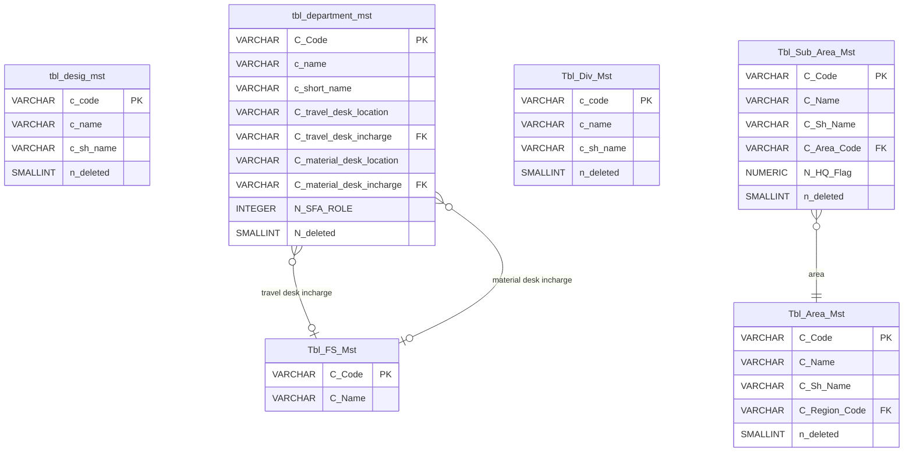

# SFA Backend - Master Data Documentation

This document provides a comprehensive guide to the **Designation Master**, **Department Master**, **Division Master**, and **Sub Area Master** APIs implemented in the Sales Force Automation (SFA) backend system. It details the endpoints, request/response models, database tables, and SQL queries used, with human-oriented explanations.

---

## 🏗 Database Schema Overview

The following diagram illustrates the tables and relationships for these master data modules:



---

## 🛠 Master Data APIs

All Master Data endpoints:
1.  Are prefixed with **`/api/masters`**.
2.  Are protected and require a header: **`Authorization: Bearer <accessToken>`**.
3.  Support paging, matching, and wildcard queries in lists (`getAll`).
4.  Implement soft deletes (`n_deleted = 1` or `N_deleted = 1`).

---

### 💼 1. Designation Master
*   **Table Name:** `tbl_desig_mst`
*   **Code format:** `DES001`, `DES002`...

#### A. Generate Next Code
*   **Method / Route:** `GET /api/masters/designation/next-code`
*   **Query:**
    ```sql
    SELECT "c_code" 
    FROM "tbl_desig_mst"
    WHERE "c_code" ~ '^DES[0-9]+$'
    ORDER BY CAST(SUBSTRING("c_code" FROM 4) AS INTEGER) DESC
    LIMIT 1;
    ```
    > **💡 Query Explanation:**
    > Finds the highest designation code to auto-increment sequentially.
    > 1. Filters with regex (`~ '^DES[0-9]+$'`) to ensure code matches standard format.
    > 2. Extracts numeric portion (`SUBSTRING("c_code" FROM 4)`) skipping "DES".
    > 3. Casts substring to integer (`CAST(... AS INTEGER)`) so sorting is numerical (e.g. 10 is higher than 9, rather than lexicographical sorting where 9 is higher than 10).
    > 4. Sorts descending and takes the top code (`LIMIT 1`). The server increments this number by 1.

#### B. Create Designation
*   **Method / Route:** `POST /api/masters/designation`
*   **Queries:**
    1.  **Duplicate check (Case-insensitive & Active only):**
        ```sql
        SELECT "c_code" 
        FROM "tbl_desig_mst"
        WHERE LOWER("c_name") = LOWER($1) -- $1: New designation name proposed by user
          AND "n_deleted" = 0;
        ```
        > **💡 Query Explanation:**
        > Uses `LOWER()` on both parts to execute a case-insensitive name check. It ignores soft-deleted entries (`n_deleted = 0`).
        
    2.  **Insert:**
        ```sql
        INSERT INTO "tbl_desig_mst" (
          "c_code", 
          "c_name", 
          "c_sh_name", 
          "n_deleted", 
          "d_created", 
          "c_modifier"
        )
        VALUES (
          $1, -- $1: Sequential generated code (e.g. 'DES002')
          $2, -- $2: Trimmed designation name (e.g. 'Area Manager')
          $3, -- $3: Trimmed short name (e.g. 'AM', optional)
          0,  -- 0: active status (not deleted)
          NOW(), -- Current database timestamp
          $4  -- $4: User ID of creating administrator
        );
        ```
        > **💡 Query Explanation:**
        > Inserts the new designation code and names. Initializes `n_deleted = 0` (active), and logs the creating admin code (`c_modifier`).

#### C. Get All / Search
*   **Method / Route:** `GET /api/masters/designation`
*   **Query:**
    ```sql
    SELECT 
      "c_code", 
      "c_name", 
      "c_sh_name", 
      "d_created", 
      "d_modified", 
      COUNT(*) OVER() AS total_count -- Virtual column calculating total records matching query filters
    FROM "tbl_desig_mst"
    WHERE "n_deleted" = 0
      AND LOWER("c_name") LIKE LOWER($1) -- $1: Wildcard pattern for name (e.g. '%sales%')
      AND LOWER("c_code") LIKE LOWER($2) -- $2: Wildcard pattern for code (e.g. 'DES%')
    ORDER BY "c_code"
    LIMIT $3    -- $3: Paging limits size (e.g. 10)
    OFFSET $4;  -- $4: Pagination skip offset (e.g. 0)
    ```
    > **💡 Query Explanation:**
    > 1. Supports case-insensitive searching with `LIKE`.
    > 2. Implements single-query pagination using the window function `COUNT(*) OVER()`. This returns the total count of all matching records (matching the WHERE filters) in a virtual column on every row. Node.js uses this to calculate total pages in a single call, avoiding a separate `COUNT` query.
    > 3. `LIMIT` and `OFFSET` define the bounds of the returned page.

#### D. Update Designation
*   **Method / Route:** `PUT /api/masters/designation/:code`
*   **Queries:**
    1.  **Check existence:**
        ```sql
        SELECT "c_code" 
        FROM "tbl_desig_mst" 
        WHERE "c_code" = $1 -- $1: Route code param (e.g. 'DES001')
          AND "n_deleted" = 0;
        ```
    2.  **Duplicate check (excluding self):**
        ```sql
        SELECT "c_code" 
        FROM "tbl_desig_mst" 
        WHERE LOWER("c_name") = LOWER($1) -- $1: New designation name proposed
          AND "n_deleted" = 0 
          AND "c_code" != $2;             -- $2: Exclude the record currently being modified
        ```
        > **💡 Query Explanation:**
        > When modifying, we check if the new name is taken by *another* designation record. Adding `AND "c_code" != $2` excludes the record being modified, preventing false alarms.
        
    3.  **Update:**
        ```sql
        UPDATE "tbl_desig_mst"
        SET 
          "c_name" = $1,      -- $1: New designation name
          "c_sh_name" = $2,   -- $2: New short name
          "d_modified" = NOW(), 
          "c_modifier" = $3   -- $3: User ID of modifying administrator
        WHERE "c_code" = $4;  -- $4: Target code to modify (e.g. 'DES001')
        ```

#### E. Delete Designation
*   **Method / Route:** `DELETE /api/masters/designation/:code`
*   **Query:**
    ```sql
    UPDATE "tbl_desig_mst"
    SET 
      "n_deleted" = 1, 
      "d_modified" = NOW(), 
      "c_modifier" = $1 -- $1: User ID of admin deleting the record
    WHERE "c_code" = $2;  -- $2: Target code to soft delete (e.g. 'DES001')
    ```
    > **💡 Query Explanation:**
    > Executes a soft delete by toggling `n_deleted = 1`. This preserves historical relationship integrity (so past logins or assignments are not broken) while removing it from active lists.

---

### 🏢 2. Department Master
*   **Table Name:** `tbl_department_mst`
*   **Code format:** `DP0001`, `DP0002`...
*   **Valid Locations:** `HYDERABAD`, `MUMBAI`

#### A. Get Travel Desk Locations (Config)
*   **Method / Route:** `GET /api/masters/department/locations`
*   **Description:** Static list of travel/material desk locations.
*   **Response:**
    ```json
    {
      "success": true,
      "data": [
        { "value": "HYDERABAD", "label": "Hyderabad" },
        { "value": "MUMBAI", "label": "Mumbai" }
      ]
    }
    ```

#### B. Generate Next Code
*   **Method / Route:** `GET /api/masters/department/next-code`
*   **Query:**
    ```sql
    SELECT "C_Code" 
    FROM "tbl_department_mst"
    WHERE "C_Code" ~ '^DP[0-9]+$'
    ORDER BY CAST(SUBSTRING("C_Code" FROM 3) AS INTEGER) DESC
    LIMIT 1;
    ```
    > **💡 Query Explanation:**
    > Sequentially increments the code using the same logic as Designation, stripping the first two characters "DP" before casting to integer.

#### C. Create Department
*   **Method / Route:** `POST /api/masters/department`
*   **Queries:**
    1.  **Duplicate check:**
        ```sql
        SELECT "C_Code" 
        FROM "tbl_department_mst" 
        WHERE LOWER("c_name") = LOWER($1) -- $1: New department name proposed
          AND "N_deleted" = 0;
        ```
    2.  **Incharge validation (against Employee Master `Tbl_FS_Mst`):**
        ```sql
        SELECT "C_Code" 
        FROM "Tbl_FS_Mst" 
        WHERE "C_Code" = $1 -- $1: Code of the employee to check (e.g. 'EMP010')
        LIMIT 1;
        ```
        > **💡 Query Explanation:**
        > Verifies that any employee code assigned as the Travel Desk Incharge or Material Desk Incharge represents a real, active employee in the field staff database.
        
    3.  **Insert:**
        ```sql
        INSERT INTO "tbl_department_mst" (
          "C_Code", 
          "c_name", 
          "c_short_name",
          "C_travel_desk_location", 
          "C_travel_desk_incharge",
          "C_material_desk_location", 
          "C_material_desk_incharge",
          "N_SFA_ROLE", 
          "N_deleted", 
          "D_created", 
          "C_modifier"
        )
        VALUES (
          $1, -- $1: Sequential generated code (e.g. 'DP0002')
          $2, -- $2: Trimmed department name (e.g. 'Human Resources')
          $3, -- $3: Trimmed short name (e.g. 'HR', optional)
          $4, -- $4: Travel Desk Location (e.g. 'HYDERABAD' or 'MUMBAI', optional)
          $5, -- $5: Employee code for travel desk incharge (e.g. 'EMP021', optional)
          $6, -- $6: Material Desk Location (e.g. 'MUMBAI', optional)
          $7, -- $7: Employee code for material desk incharge (e.g. 'EMP033', optional)
          $8, -- $8: SFA Role access flag (0 = No, 1 = Yes)
          0,  -- 0: active status (not deleted)
          NOW(), -- Current database timestamp
          $9  -- $9: User ID of creating administrator
        );
        ```

#### D. Get All / Search
*   **Method / Route:** `GET /api/masters/department`
*   **Query:**
    ```sql
    SELECT 
      "C_Code",
      "c_name",
      "c_short_name",
      "C_travel_desk_location",
      "C_travel_desk_incharge",
      "C_material_desk_location",
      "C_material_desk_incharge",
      "N_SFA_ROLE",
      "D_created",
      "D_modified", 
      COUNT(*) OVER() AS total_count -- Virtual column calculating total records matching query filters
    FROM "tbl_department_mst"
    WHERE "N_deleted" = 0
      AND LOWER("c_name") LIKE LOWER($1) -- $1: Wildcard pattern for name (e.g. '%logistics%')
      AND LOWER("C_Code") LIKE LOWER($2) -- $2: Wildcard pattern for code (e.g. 'DP%')
    ORDER BY "C_Code"
    LIMIT $3    -- $3: Paging limits size (e.g. 10)
    OFFSET $4;  -- $4: Pagination skip offset (e.g. 0)
    ```
    > **💡 Query Explanation:**
    > Searches departments with wildcard mapping. Includes windowed total record count for API pagination mathematical operations.

#### E. Update Department
*   **Method / Route:** `PUT /api/masters/department/:code`
*   **Queries:**
    1.  **Check existence:**
        ```sql
        SELECT "C_Code" 
        FROM "tbl_department_mst" 
        WHERE "C_Code" = $1 -- $1: Route code param (e.g. 'DP0001')
          AND "N_deleted" = 0;
        ```
    2.  **Duplicate check (excluding self):**
        ```sql
        SELECT "C_Code" 
        FROM "tbl_department_mst" 
        WHERE LOWER("c_name") = LOWER($1) -- $1: New department name proposed
          AND "N_deleted" = 0 
          AND "C_Code" != $2;             -- $2: Exclude the record currently being modified
        ```
    3.  **Incharge validation:** Same validation as Create.
    4.  **Update:**
        ```sql
        UPDATE "tbl_department_mst"
        SET 
          "c_name" = $1, 
          "c_short_name" = $2,
          "C_travel_desk_location" = $3, 
          "C_travel_desk_incharge" = $4,
          "C_material_desk_location" = $5, 
          "C_material_desk_incharge" = $6,
          "N_SFA_ROLE" = $7,
          "D_modified" = NOW(), 
          "C_modifier" = $8     -- $8: User ID of modifying administrator
        WHERE "C_Code" = $9;    -- $9: Target department code to modify (e.g. 'DP0001')
        ```

#### E. Delete Department
*   **Method / Route:** `DELETE /api/masters/department/:code`
*   **Query:**
    ```sql
    UPDATE "tbl_department_mst"
    SET 
      "N_deleted" = 1, 
      "D_modified" = NOW(), 
      "C_modifier" = $1 -- $1: User ID of admin deleting the record
    WHERE "C_Code" = $2;  -- $2: Target department code to soft delete (e.g. 'DP0001')
    ```
    > **💡 Query Explanation:**
    > Sets `N_deleted = 1` for soft deletion, preserving data integrity for audits.

---

### 🌐 3. Division Master
*   **Table Name:** `Tbl_Div_Mst`
*   **Code format:** `DI0001`, `DI0002`...

#### A. Generate Next Code
*   **Method / Route:** `GET /api/masters/division/next-code`
*   **Query:**
    ```sql
    SELECT "c_code" 
    FROM "Tbl_Div_Mst"
    WHERE "c_code" ~ '^DI[0-9]+$'
    ORDER BY CAST(SUBSTRING("c_code" FROM 3) AS INTEGER) DESC
    LIMIT 1;
    ```
    > **💡 Query Explanation:**
    > Finds the highest division code to auto-increment sequentially.
    > 1. Filters with regex (`~ '^DI[0-9]+$'`) to ensure code matches standard format.
    > 2. Extracts numeric portion (`SUBSTRING("c_code" FROM 3)`) skipping "DI".
    > 3. Casts substring to integer (`CAST(... AS INTEGER)`) so sorting is numerical.
    > 4. Sorts descending and takes the top code (`LIMIT 1`). The server increments this number by 1.

#### B. Create Division
*   **Method / Route:** `POST /api/masters/division`
*   **Queries:**
    1.  **Duplicate check (Case-insensitive & Active only):**
        ```sql
        SELECT "c_code" 
        FROM "Tbl_Div_Mst"
        WHERE LOWER("c_name") = LOWER($1) -- $1: New division name proposed by user
          AND "n_deleted" = 0;
        ```
        > **💡 Query Explanation:**
        > Uses `LOWER()` on both parts to execute a case-insensitive name check. It ignores soft-deleted entries (`n_deleted = 0`).
        
    2.  **Insert:**
        ```sql
        INSERT INTO "Tbl_Div_Mst" (
          "c_code", 
          "c_name", 
          "c_sh_name", 
          "n_deleted", 
          "d_created", 
          "c_modifier"
        )
        VALUES (
          $1, -- $1: Sequential generated code (e.g. 'DI0002')
          $2, -- $2: Trimmed division name (e.g. 'Pharma')
          $3, -- $3: Trimmed short name (e.g. 'PH', optional)
          0,  -- 0: active status (not deleted)
          NOW(), -- Current database timestamp
          $4  -- $4: User ID of creating administrator
        );
        ```
        > **💡 Query Explanation:**
        > Inserts the new division code and names. Initializes `n_deleted = 0` (active), and logs the creating admin code (`c_modifier`).

#### C. Get All / Search
*   **Method / Route:** `GET /api/masters/division`
*   **Query:**
    ```sql
    SELECT 
      "c_code", 
      "c_name", 
      "c_sh_name", 
      "d_created", 
      "d_modified", 
      COUNT(*) OVER() AS total_count -- Virtual column calculating total records matching query filters
    FROM "Tbl_Div_Mst"
    WHERE "n_deleted" = 0
      AND LOWER("c_name") LIKE LOWER($1) -- $1: Wildcard pattern for name (e.g. '%sales%')
      AND LOWER("c_code") LIKE LOWER($2) -- $2: Wildcard pattern for code (e.g. 'DI%')
    ORDER BY "c_code"
    LIMIT $3    -- $3: Paging limits size (e.g. 10)
    OFFSET $4;  -- $4: Pagination skip offset (e.g. 0)
    ```
    > **💡 Query Explanation:**
    > 1. Supports case-insensitive searching with `LIKE` and wildcards.
    > 2. Implements single-query pagination using the window function `COUNT(*) OVER()`. This returns the total count of all matching records.
    > 3. `LIMIT` and `OFFSET` define the bounds of the returned page.

#### D. Update Division
*   **Method / Route:** `PUT /api/masters/division/:code`
*   **Queries:**
    1.  **Check existence:**
        ```sql
        SELECT "c_code" 
        FROM "Tbl_Div_Mst" 
        WHERE "c_code" = $1 -- $1: Route code param (e.g. 'DI0001')
          AND "n_deleted" = 0;
        ```
    2.  **Duplicate check (excluding self):**
        ```sql
        SELECT "c_code" 
        FROM "Tbl_Div_Mst" 
        WHERE LOWER("c_name") = LOWER($1) -- $1: New division name proposed
          AND "n_deleted" = 0 
          AND "c_code" != $2;             -- $2: Exclude the record currently being modified
        ```
        > **💡 Query Explanation:**
        > When modifying, we check if the new name is taken by *another* division record. Adding `AND "c_code" != $2` excludes the record being modified.
        
    3.  **Update:**
        ```sql
        UPDATE "Tbl_Div_Mst"
        SET 
          "c_name" = $1,      -- $1: New division name
          "c_sh_name" = $2,   -- $2: New short name
          "d_modified" = NOW(), 
          "c_modifier" = $3   -- $3: User ID of modifying administrator
        WHERE "c_code" = $4;  -- $4: Target code to modify (e.g. 'DI0001')
        ```

#### E. Delete Division
*   **Method / Route:** `DELETE /api/masters/division/:code`
*   **Query:**
    ```sql
    UPDATE "Tbl_Div_Mst"
    SET 
      "n_deleted" = 1, 
      "d_modified" = NOW(), 
      "c_modifier" = $1 -- $1: User ID of admin deleting the record
    WHERE "c_code" = $2;  -- $2: Target code to soft delete (e.g. 'DI0001')
    ```
    > **💡 Query Explanation:**
    > Executes a soft delete by toggling `n_deleted = 1`. This preserves historical relationship integrity while removing it from active lists.

---

### 🗺 4. Sub Area Master
*   **Table Name:** `Tbl_Sub_Area_Mst`
*   **Code format:** `SA0001`, `SA0002`...

#### A. Generate Next Code
*   **Method / Route:** `GET /api/masters/sub-area/next-code`
*   **Query:**
    ```sql
    SELECT "C_Code" 
    FROM "Tbl_Sub_Area_Mst"
    WHERE "C_Code" ~ '^SA[0-9]+$'
    ORDER BY CAST(SUBSTRING("C_Code" FROM 3) AS INTEGER) DESC
    LIMIT 1;
    ```
    > **💡 Query Explanation:**
    > Finds the highest sub area code to auto-increment sequentially.
    > 1. Filters with regex (`~ '^SA[0-9]+$'`) to ensure code matches standard format.
    > 2. Extracts numeric portion (`SUBSTRING("C_Code" FROM 3)`) skipping "SA".
    > 3. Casts substring to integer (`CAST(... AS INTEGER)`) so sorting is numerical.
    > 4. Sorts descending and takes the top code (`LIMIT 1`). The server increments this number by 1.

#### B. Create Sub Area
*   **Method / Route:** `POST /api/masters/sub-area`
*   **Queries:**
    1.  **Duplicate check (Case-insensitive & Active only):**
        ```sql
        SELECT "C_Code" 
        FROM "Tbl_Sub_Area_Mst"
        WHERE LOWER("C_Name") = LOWER($1)
          AND "C_Area_Code" = $2
          AND "n_deleted" = 0;
        ```
        > **💡 Query Explanation:**
        > Checks for name duplicates in the same Area. It ignores soft-deleted entries (`n_deleted = 0`).
        
    2.  **Area validation (against Area Master `Tbl_Area_Mst`):**
        ```sql
        SELECT "C_Code" 
        FROM "Tbl_Area_Mst" 
        WHERE "C_Code" = $1 AND "n_deleted" = 0
        LIMIT 1;
        ```
        > **💡 Query Explanation:**
        > Verifies that the Area Code assigned represents a real, active Area in the Area Master table.
        
    3.  **Insert:**
        ```sql
        INSERT INTO "Tbl_Sub_Area_Mst" (
          "C_Code", 
          "C_Name", 
          "C_Sh_Name", 
          "C_Area_Code", 
          "N_HQ_Flag", 
          "n_lami", 
          "n_lgmi", 
          "C_Classification_Code", 
          "n_deleted", 
          "d_created", 
          "c_modifier"
        )
        VALUES (
          $1, -- $1: Sequential generated code (e.g. 'SA0002')
          $2, -- $2: Trimmed sub area name (e.g. 'Cyber Towers')
          $3, -- $3: Trimmed short name (e.g. 'CTS', optional)
          $4, -- $4: Area Code (e.g. 'A00001')
          $5, -- $5: Same HQ Flag (0 = No, 1 = Yes)
          $6, -- $6: Latitude (optional)
          $7, -- $7: Longitude (optional)
          $8, -- $8: Classification code (optional)
          0,  -- 0: active status (not deleted)
          NOW(), -- Current database timestamp
          $9  -- $9: User ID of creating administrator
        );
        ```

#### C. Get All / Search
*   **Method / Route:** `GET /api/masters/sub-area`
*   **Query:**
    ```sql
    SELECT sa."C_Code" as c_code, sa."C_Name" as c_name, sa."C_Sh_Name" as c_sh_name, 
           sa."C_Area_Code" as c_area_code, a."C_Name" as c_area_name,
           sa."N_HQ_Flag" as n_hq_flag, sa."n_lami" as n_lami, sa."n_lgmi" as n_lgmi,
           sa."C_Classification_Code" as c_classification_code,
           sa."d_created", sa."d_modified", COUNT(*) OVER() AS total_count
    FROM "Tbl_Sub_Area_Mst" sa
    LEFT JOIN "Tbl_Area_Mst" a ON sa."C_Area_Code" = a."C_Code"
    WHERE sa."n_deleted" = 0
      AND LOWER(sa."C_Name") LIKE LOWER($1) -- $1: Wildcard pattern for name (e.g. '%cyber%')
      AND LOWER(sa."C_Code") LIKE LOWER($2) -- $2: Wildcard pattern for code (e.g. 'SA%')
      AND (LOWER(sa."C_Area_Code") LIKE LOWER($3) OR LOWER(a."C_Name") LIKE LOWER($3)) -- $3: Wildcard pattern for Area
    ORDER BY sa."C_Code"
    LIMIT $4    -- $4: Paging limits size (e.g. 10)
    OFFSET $5;  -- $5: Pagination skip offset (e.g. 0)
    ```
    > **💡 Query Explanation:**
    > 1. Supports case-insensitive searching with `LIKE` and wildcards for name, code, and area.
    > 2. Joins `Tbl_Area_Mst` to retrieve the parent Area Name.
    > 3. Implements single-query pagination using the window function `COUNT(*) OVER()`.

#### D. Update Sub Area
*   **Method / Route:** `PUT /api/masters/sub-area/:code`
*   **Queries:**
    1.  **Check existence:**
        ```sql
        SELECT "C_Code" 
        FROM "Tbl_Sub_Area_Mst" 
        WHERE "C_Code" = $1 AND "n_deleted" = 0;
        ```
    2.  **Duplicate check (excluding self):**
        ```sql
        SELECT "C_Code" 
        FROM "Tbl_Sub_Area_Mst" 
        WHERE LOWER("C_Name") = LOWER($1) 
          AND "C_Area_Code" = $2 
          AND "n_deleted" = 0 
          AND "C_Code" != $3;
        ```
    3.  **Update:**
        ```sql
        UPDATE "Tbl_Sub_Area_Mst"
        SET 
          "C_Name" = $1, 
          "C_Sh_Name" = $2, 
          "C_Area_Code" = $3, 
          "N_HQ_Flag" = $4, 
          "n_lami" = $5, 
          "n_lgmi" = $6, 
          "C_Classification_Code" = $7,
          "d_modified" = NOW(), 
          "c_modifier" = $8
        WHERE "C_Code" = $9;
        ```

#### E. Delete Sub Area
*   **Method / Route:** `DELETE /api/masters/sub-area/:code`
*   **Query:**
    ```sql
    UPDATE "Tbl_Sub_Area_Mst"
    SET 
      "n_deleted" = 1, 
      "d_modified" = NOW(), 
      "c_modifier" = $1
    WHERE "C_Code" = $2;
    ```
    > **💡 Query Explanation:**
    > Performs a soft delete by setting `n_deleted = 1`.

---

## 📬 Postman Collections Reference

Ready-to-use Postman collections for testing these core APIs are located in the `postman/` folder:
*   `postman/SFA_Designation_Master.postman_collection.json` — Designation endpoints.
*   `postman/SFA_Department_Master.postman_collection.json` — Department endpoints and locations config list.
*   `postman/SFA_Division_Master.postman_collection.json` — Division endpoints.
*   `postman/SFA_Sub_Area_Master.postman_collection.json` — Sub Area endpoints.
